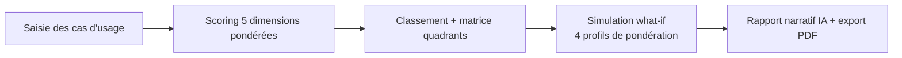

# Playbook — AI Use Case Prioritizer

> Guide opératoire structuré en 4 volets (Définitions / Process / Documentation / Templates).
> Voir [`README.md`](README.md) pour le contexte complet.

---

## 1. Définitions

| Terme | Définition |
|---|---|
| **Quick Win** | Impact ≥ 6 et Faisabilité ≥ 6 — à lancer immédiatement |
| **Strategic Bet** | Impact ≥ 6, Faisabilité < 6 — à planifier à 12-18 mois |
| **Fill-in** | Impact < 6, Faisabilité ≥ 6 — pipeline secondaire |
| **Questionable** | Impact < 6, Faisabilité < 6 — à déprioritiser |

**Modèle de scoring** — 5 dimensions pondérées (détail dans `README.md`) :
Impact Business (30%) · Faisabilité Technique (25%) · Délai de Valeur (20%) · Alignement Stratégique (15%) · Risque & Conformité (10%).

## 2. Process

1. **Saisie** — cas d'usage avec 5 critères notés (Impact, Faisabilité, Délai, Alignement, Risque).
2. **Scoring** — moyenne pondérée configurable via la sidebar, pas de poids figés en dur.
3. **Classement & quadrants** — bubble chart Impact × Faisabilité, quadrants calculés automatiquement.
4. **Simulation** — comparaison de 4 profils de pondération (ROI, rapidité, sécurité...) pour voir comment le classement change selon la priorité stratégique.
5. **Rapport** — narrative exécutive générée (Claude Haiku, BYOK) + export PDF.

**Point de décision réutilisable** : les poids sont configurables plutôt que figés — le même outil sert un board orienté ROI et un board orienté rapidité de mise en œuvre, sans changer le code.

## 3. Documentation

- [`README.md`](README.md) — modèle de scoring, quadrants, stack, cas d'usage pré-chargés

## 4. Templates réutilisables

- **Le moteur de scoring pondéré configurable** (`app.py`) — directement transposable à tout exercice de priorisation multi-critères (pas seulement IA : features produit, initiatives RH, projets data).
- **Le pattern "4 profils de simulation"** — réutilisable pour montrer à un board comment une décision change selon la priorité stratégique choisie.

**Règle de transposition** : pour un vrai client, remplacer les 8 cas d'usage pré-chargés (secteur Luxe/Mode) par les projets réels du client — le moteur de scoring et les quadrants restent identiques.

---

*Gisèle Metouck — Consultante Data Steward & Gouvernance · [GitHub](https://github.com/Kingdmfncr)*
